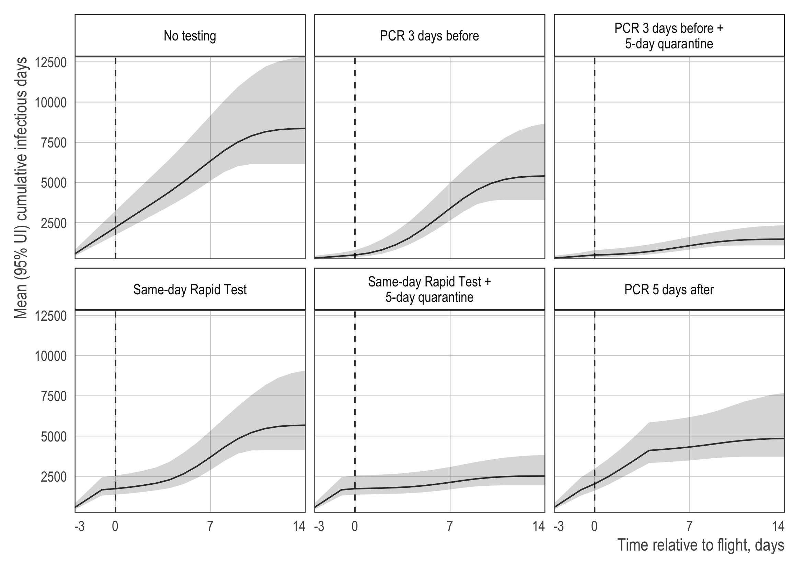

<!-- README.md is generated from README.Rmd. Please edit that file -->

# Routine testing strategies for airline travel during the COVID-19 pandemic: a simulation analysis

## Introduction

Reproducible code for our *The Lancet Infectious Diseases* paper,
[*Routine testing strategies for airline travel during the COVID-19
pandemic: a simulation
study*](http://www.thelancet.com/journals/laninf/article/PIIS1473-3099(21)00134-1/fulltext),
in which we use microsimulation to estimate the effectiveness of
different testing strategies on reducing SARS-CoV-2 transmission in a
cohort of hypothetical airline travels.

The full citation is:

> Kiang MV, Chin ET, Huynh BQ, Chapman LAC, Rodríguez-Barraquer I,
> Greenhouse B, Rutherford GW, Bibbins-Domingo K, Havlir D, Basu S, and
> Lo NC. Routine asymptomatic testing strategies for airline travel
> during the COVID-19 pandemic: a simulation study. *The Lancet
> Infectious Diseases* (March 2021). doi:
> [10.1016/S1473-3099(21)00134-1](https://doi.org/10.1016/S1473-3099(21)00134-1)

### Abstract

**Background** Routine viral testing strategies for SARS-CoV-2 infection
might facilitate safe airline travel during the COVID-19 pandemic and
mitigate global spread of the virus. However, the effectiveness of these
test-and-travel strategies to reduce passenger risk of SARS-CoV-2
infection and population-level transmission remains unknown.

**Methods** In this simulation study, we developed a microsimulation of
SARS-CoV-2 transmission in a cohort of 100 000 US domestic airline
travellers using publicly available data on COVID-19 clinical cases and
published natural history parameters to assign individuals one of five
health states of susceptible to infection, latent period, early
infection, late infection, or recovered. We estimated a per-day risk of
infection with SARS-CoV-2 corresponding to a daily incidence of 150
infections per 100000 people. We assessed five testing strategies: (1)
anterior nasal PCR test within 3 days of departure, (2) PCR within 3
days of departure and 5 days after arrival, (3) rapid antigen test on
the day of travel (assuming 90% of the sensitivity of PCR during active
infection), (4) rapid antigen test on the day of travel and PCR test 5
days after arrival, and (5) PCR test 5 days after arrival. Strategies 2
and 4 included a 5-day quarantine after arrival. The travel period was
defined as 3 days before travel to 2 weeks after travel. Under each
scenario, individuals who tested positive before travel were not
permitted to travel. The primary study outcome was cumulative number of
infectious days in the cohort over the travel period without isolation
or quarantine (population-level transmission risk), and the key
secondary outcome was the number of infectious people detected on the
day of travel (passenger risk of infection).

**Findings** We estimated that in a cohort of 100 000 airline
travellers, in a scenario with no testing or screening, there would be
8357 (95% uncertainty interval 6144–12831) infectious days with 649
(505–950) actively infectious passengers on the day of travel. The
pre-travel PCR test reduced the number of infectious days from 8357 to
5401 (3917–8677), a reduction of 36% (29–41) compared with the base
case, and identified 569 (88% \[76–92\]) of 649 actively infectious
travellers on the day of flight; the addition of post-travel quarantine
and PCR reduced the number of infectious days to 1474 (1087–2342), a
reduction of 82% (80–84) compared with the base case. The rapid antigen
test on the day of travel reduced the number of infectious days to 5674
(4126–9081), a reduction of 32% (26–38) compared with the base case, and
identified 560 (86% \[83–89\]) actively infectious travellers; the
addition of post-travel quarantine and PCR reduced the number of
infectious days to 2518 (1935–3821), a reduction of 70% (67–72) compared
with the base case. The post- travel PCR alone reduced the number of
infectious days to 4851 (3714–7679), a reduction of 42% (35–49) compared
with the base case.

**Interpretation** Routine asymptomatic testing for SARS-CoV-2 before
travel can be an effective strategy to reduce passenger risk of
infection during travel, although abbreviated quarantine with
post-travel testing is probably needed to reduce population-level
transmission due to importation of infection when travelling from a high
to low incidence setting.

### Issues

Please report issues via email or the [issues
page](https://github.com/mkiang/airline_testing_strategies/issues).

### Changes reflecting comments from others (and our reply)

We thank Dr. Mohammad Shahid and Dr. Lee Altenberg for their letters
\[[1](https://www.thelancet.com/journals/laninf/article/PIIS1473-3099(21)00357-1/fulltext),
[2](https://www.thelancet.com/journals/laninf/article/PIIS1473-3099(21)00454-0/fulltext)\]
and interest in our paper.

As outlined [in our
reply](https://www.thelancet.com/journals/laninf/article/PIIS1473-3099(21)00562-4/fulltext),
Dr. Lee Altenberg suggested additional analyses looking at (a) *only*
post-travel infectious days and (b) the number of infections per day.
The results from these analyses are now presented in the updated
Supplemental Materials as Tables S2 and S3, respectively. In addition,
Dr. Altenberg suggested a correction to the accounting of quarantine
days in our paper. We fully agree and have corrected the numbers
accordingly in the main manuscript. This change affects the scenarios
with quarantine, and improves their effectiveness — highlighting the
importance of both testing and quarantine of airline passengers. Both
[the
correction](https://www.thelancet.com/journals/laninf/article/PIIS1473-3099(21)00614-9/fulltext)
and [the corrected
manuscript](http://www.thelancet.com/journals/laninf/article/PIIS1473-3099(21)00134-1/fulltext)
are available online. The code and [replication
data](https://osf.io/87kga/) have been been updated to reflect these
changes.

## Structure

This project is structured as follows:

-   `code`: Contains all code used for this project. Designed to be run
    sequentially. A brief overview of the code files is provided below.
-   `data`: Contains all summarized data necessary to reproduce our
    tables and plots.
-   `data_raw`: Contains processed data from intermediate files but
    before summarizing. (Not on Github.)
-   `intermediate_files`: Contains temporary files not necessary to
    reproduce our tables and plots. You can download [our original
    intermediate files on OSF](https://osf.io/87kga/) and unzip it in
    the project root.
-   `output`: Contains numerical representations (in `csv` form) of all
    figures.
-   `plots`: Contains all figures used the manuscript in `jpg` and
    `pdf`.
-   `rmds`: Contains useful rmarkdown files such as reproducing our
    tables and providing session information.

Note, we use the `config.yml` file to modify high-level project-wide
parameters.

### Reproducibility

All information necessary for full reproducibility, including package
version numbers, is available in `./rmds/02_session_info.html`. This
project uses the
[`renv`](https://rstudio.github.io/renv/articles/renv.html) package for
package version control. To use this, open the project in
[RStudio](https://rstudio.com/) and run `renv::restore()`.

### `config.yml`

Simulation parameters such as the length of quarantine, number of
burn-in days, number of passengers, proportion of subclinical
infections, daily probability of infection, etc. can be changed in the
`config.yml` file. In addition, the `config.yml` file lets you specify
different sensitivity analysis configurations and allows you to vary one
(or more) parameters across the default parameter sweep. See the
`config.yml` file for details.

## `./code`

The analytic pipeline in the `./code`/ folder is designed to have each
file run sequentially. That is, each file performs a discrete task and
some tasks may be dependent on the output of previous tasks.

-   `utils.R`: Contains almost all helper functions and functions
    necessary to run the simulations or create the plots. Most functions
    within `utils.R` use the
    [`roxygen2`](https://cran.r-project.org/web/packages/roxygen2/vignettes/roxygen2.html)
    documentation template. See this documentation for expected input,
    output, and notes about each function. Minor or self-explanatory
    functions may not include `roxygen2` docs.
-   `01_create_simulated_populations.R`: Creates and performs the
    burn-in for all simulated passenger cohorts. In addition, each
    simulation state is saved with the random seed used to create the
    simulation as well as the seed necessary to resume the simulation.
    Each testing scenario calls one of the simulation states created
    here (using `unpack_simulation_state()`).
-   `02_run_main_simulations.R`: Run all testing scenarios used for the
    main results. Each simulation result is saved in
    `./intermediate_files` to be collected later using
    `04_summarize_infection_quantities.R` and
    `05_summarize_testing_quantites.R` and then saved in `./data`.
-   `03_run_sensitivity_analyses.R`: Run all testing scenarios used for
    the main results. Each simulation result is saved in
    `intermediate_files` to be collected later using
    `04_summarize_infection_quantities.R` and
    `05_summarize_testing_quantites.R` and then saved in `./data`.
-   `04_gather_and_munge_intermediate_files.R`: Processes all the raw
    simulations in `intermediate_files` and saves them in `data_raw`.
-   `05_summarize_infection_quantities.R`: Processes the raw files
    created in `04`, summarized them, and then saves the results in
    `./data`. This file saves the time-varying quantities of interest
    and our primary end points.
-   `06_summarize_testing_quantites.R`: Processes the raw files created
    in `04`, summarized them, and then saves the results in `./data`.
    This file saves the time-invariant quantities (e.g., testing
    results).

Other files can be run in any order after `05` and `06` have
successfully run. These files create plots used in the main manuscript
or associated appendix.

### `./code/testing_scenarios`

Testing scenarios are written as functions that take in all necessary
parameters and return no output, instead they save their intermediate
results in a temporary location. The structure each function is the
same:

1.  Load a simulated population using `unpack_simulation_state()`
2.  Increment pre-flight time steps
3.  Increment the day-of-flight time step
4.  Increment post-flight time steps
5.  Repeat these steps `n_reps` number of times
6.  Save all `n_reps` realizations into a temporary file in
    `./intermediate_files`

The scenarios themselves change in what happens within each stage above.
For example, pre-flight testing strategies would occur in Step 2. The
day-of-flight risk multiplier only impacts Step 3. Post-flight testing
strategies occur in Step 4. See the documentation within each scenario
file in `./code/testing_scenarios` for details.

## Authors (alphabetical):

-   [Sanjay
    Basu](https://primarycare.hms.harvard.edu/faculty-staff/sanjay-basu)
    (:
    [sanjaybasu](https://github.com/sanjaybasu) \|
    :
    [@sanjaybmdphd](https://twitter.com/sanjaybmdphd))
-   [Kirsten
    Bibbins-Domingo](https://profiles.ucsf.edu/kirsten.bibbins-domingo)
    (:
    [@KBibbinsDomingo](https://twitter.com/KBibbinsDomingo))
-   [Lloyd Chapman](https://profiles.ucsf.edu/lloyd.chapman)
    (:
    [@lloyd\_chapman\_](https://twitter.com/lloyd_chapman_))
-   [Elizabeth Chin](https://etchin.github.io)
    (:
    [etchin](https://github.com/etchin) \|
    :
    [@elizabethtchin](https://twitter.com/elizabethtchin))
-   [Bryan Greenhouse](https://profiles.ucsf.edu/bryan.greenhouse)
    (:
    [@bgreenhouse1](https://twitter.com/bgreenhouse1))
-   [Diane Havlir](https://profiles.ucsf.edu/diane.havlir)
-   [Benjamin Huynh](https://benhuynh.github.io/)
    (:
    [@benqhuynh](https://twitter.com/benqhuynh))
-   [Mathew Kiang](https://mathewkiang.com)
    (:
    [mkiang](https://github.com/mkiang) \|
    :
    [@mathewkiang](https://twitter.com/mathewkiang))
-   [Nathan Lo](https://profiles.ucsf.edu/nathan.lo)
    (:
    [NathanLo3](https://github.com/NathanLo3) \|
    :
    [@NathanLo3579](https://twitter.com/NathanLo3579))
-   [Isabel
    Rodríguez-Barraquer](https://profiles.ucsf.edu/isabel.rodriguez-barraquer)
    (:
    [isabelrodbar](https://github.com/isabelrodbar) \|
    :
    [@isabelrodbar](https://twitter.com/isabelrodbar))
-   [George Rutherford](https://profiles.ucsf.edu/george.rutherford)
    (:
    [@rutherford\_ucsf](https://twitter.com/rutherford_ucsf))

## Attribution

This simulation code is heavily based on the paper, [*Frequency of
Routine Testing for Coronavirus Disease 2019 (COVID-19) in High-risk
Healthcare Environments to Reduce
Outbreaks*](https://academic.oup.com/cid/advance-article/doi/10.1093/cid/ciaa1383/5939986),
by Chin et al. and the accompanying [Github
repository](https://github.com/etchin/covid-testing).

## Pre-print version

An earlier, [pre-print version of our paper is available on
medRxiv](https://www.medrxiv.org/content/10.1101/2020.12.08.20246132v1).
Several large changes were made in response to reviewers; however, [the
state of the code when the pre-print was submitted is available in the
pre-print
release](https://github.com/mkiang/airline_testing_strategies/releases/tag/preprint).
